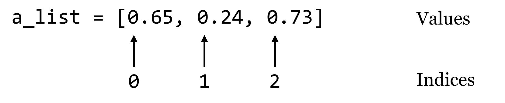
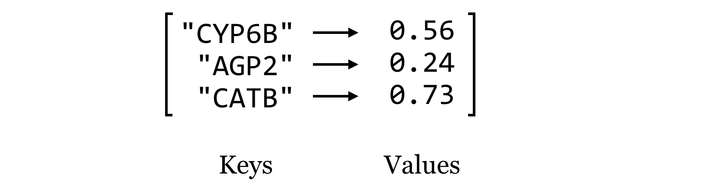

# Too Busy, Grabbing Pizza

## Going for Badge Completion

- [Dashboard](https://docs.google.com/spreadsheets/d/1sxEx6am-LoW0dZMMwnnI3huwZSrxVOC73y5TyQuIX9g/edit?usp=sharing)
- 4 out of 5 exercises needed for completion
- You have until March 16 End of Day (5 PM PST) to turn in exercises for the badge

## Goals of the course

. . .

-   Continue building *programming fundamentals*: How to use complex data structures, how to iterate repeated tasks, and write your own functions.

. . .

-   Continue exploration of *data science fundamentals*: how to clean messy data using the programming fundamentals above to a Tidy form for analysis.

## What have we covered in 6 weeks?

-   Iterable data structures: Lists, Strings, Dictionaries, Tuples,

    -   Access elements via `[ ]`

    -   For Loops

    -   Length via `len()`

    -   Check for presence of elements via `in`

## What have we covered in 6 weeks?

-   Dictionaries vs Lists

    {width="400"}

    {width="400"}

    -   Access elements via `[ ]` vs. `.get()` method

[Source](https://open.oregonstate.education/app/uploads/sites/6/2016/10/II.8_2_dict_keys_values.png#fixme)

## What have we covered in 6 weeks?

-   Iteration

    -   For loops

        -   Classic form `for value in my_list:`

        -   Modify the data structure via `for index, value in enumerate(my_list):`

        -   Creating a new list via `new_list.append(element)`

    -   List comprehension

    -   Maps when working with Dataframes

. . .

-   Conditional statements

    -   Within For loops

. . .

-   Writing your own function :)

## What's next?

-   An important lesson I didn't get to: [Reference vs. Copy](https://hutchdatascience.org/Intermediate_Python/06-Reference_vs_Copy.html)

-   [Python for Data Analysis](https://wesmckinney.com/book/)

-   Stay tuned for future classes...

## Machine Learning for Python (Spring Quarter)

> The course covers the framework of machine learning for predictive modeling and model interpretation from a practitioner's perspective. 

> You will be able to implement several popular machine learning techniques based on the question of interest and the dataset at hand. You will then evaluate the model based on their performance and diagnostics to understand its strengths and limitations. 

> Technical mathematics and algorithms will not be emphasized.

## End of class stickers

## End of class stickers

{width="300"}

## End of class surveys

- How was the course for you?
- <https://forms.gle/Z7cZLTA7UPi5dkKXA>

## Go over last exercise, and some more
